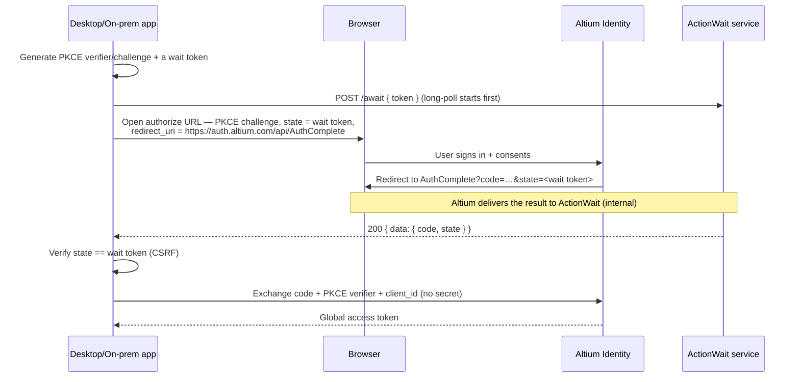

# Authenticate a desktop or on-prem application

Desktop and on-premises applications usually cannot host a public HTTPS redirect endpoint, yet OAuth requires the authorization response to arrive at a registered callback. The **ActionWait** pattern solves this: the user still signs in through the browser, the browser is redirected to an **Altium-hosted** callback page, and your application picks up the result over an HTTP long-polling channel instead of hosting a redirect itself.

Desktop and on-prem apps are typically **public clients** — they cannot keep a client secret, so they authenticate with **PKCE** and never send a `client_secret`. See [Key terms](./overview.md#key-terms) for token vocabulary and [Register your application](./register-your-application.md) for registration.

## The linchpin: one value is both `state` and the wait token

Your app generates a single high-entropy value (a UUID works well) and uses it in two places at once:

- as the OAuth **`state`** parameter in the authorize request, and
- as the ActionWait **wait token** it long-polls with.

That shared value is what correlates the browser redirect back to your waiting app: the Altium-hosted callback receives the `code` and `state` from the browser and hands them to the ActionWait service, which routes them to the poll whose token equals that `state`. Because only your app and Altium Identity know this value, verifying that the returned `state` matches the token you generated also serves as **CSRF protection**.

## How the ActionWait pattern works



> Start the long-poll **before** opening the browser, so a fast sign-in cannot deliver the result before you are listening for it.

After your app receives the authorization code, it continues with the same logical steps as a web application — exchange the code for a global access token, discover workspaces, exchange for a workspace access token, and refresh — **but as a public client**: the token requests carry `client_id` and (for the code exchange) the PKCE `code_verifier`, and **no** `client_secret` or `Authorization: Basic` header. See [Discover the user's workspaces](./web-and-server-apps.md#step-3--discover-the-users-workspaces) onward for the workspace steps.

### Exchange the code (public client)

```
POST https://auth.altium.com/connect/token
Content-Type: application/x-www-form-urlencoded

grant_type=authorization_code
&code=<code>
&code_verifier=<code_verifier>
&redirect_uri=https%3A%2F%2Fauth.altium.com%2Fapi%2FAuthComplete
&client_id=<client_id>
```

`redirect_uri` must be the same Altium-hosted callback you used in the authorize request (`https://auth.altium.com/api/AuthComplete`), and must match exactly.

### Gov Cloud workspaces

Everything above — the browser sign-in, the `AuthComplete` redirect, the ActionWait poll host, and the code exchange — runs on Commercial `auth.altium.com` and yields a global access token. To use a **Gov Cloud** workspace, exchange that global token for a workspace token on the Gov endpoint with `secure=1`, exactly as in the web guide's [Step 4 — Gov variant](./web-and-server-apps.md#step-4--exchange-for-a-workspace-access-token). As a public client you send `client_id` (no secret); the request is otherwise identical. Use each workspace's `location.name` (`"US GovCloud"`) to decide which endpoint to exchange on.

## ActionWait service API

The ActionWait service is a **separate host** from Altium Identity: `https://actionwait.altium.com`.

**`POST /await`** — long-polls for the authorization result tied to your wait token.

Request (`Content-Type: application/json`):
```json
{ "token": "<wait_token>" }
```
Response on success (`200`):
```json
{ "data": { "code": "<authorization_code>", "state": "<wait_token>" } }
```
- `data.code` — the OAuth authorization code; exchange it at the token endpoint.
- `data.state` — echoes your wait token; **verify it matches** before exchanging the code.

Status codes:
- `200` — the result is ready (body as above).
- `408` — the server's long-poll idle window elapsed with no result yet. **This is normal, not a failure** — immediately reconnect by POSTing `/await` again with the **same** token. Repeat until you get `200`, hit `410`, or your own overall timeout elapses.
- `410` — the wait token is no longer valid: it was already consumed, or a newer `/await` for the same token superseded this connection. Treat the attempt as over — start a fresh sign-in from the authorize step with a **new** wait token.

`/await` is the only ActionWait endpoint your application calls. How the result is delivered to the service after the browser reaches the redirect page is handled internally by Altium.

## Troubleshooting

| Symptom | Likely cause | Fix |
| --- | --- | --- |
| `/await` returns `408` repeatedly | Normal long-poll cycling while the user is still signing in | Keep reconnecting with the same token; only give up after your own overall timeout |
| `/await` returns `410` | Token already consumed, or a second poll superseded this one | Start a new sign-in from the authorize step with a fresh token |
| Browser completes but app never returns | The `state` in the authorize request didn't match the `token` you poll with | Use the identical value for `state` and the wait `token` |
| `State mismatch` after `200` | Returned `data.state` ≠ your wait token (possible CSRF) | Abort the sign-in; do not exchange the code |
| `invalid_grant` at token endpoint | Code expired/already used, or `redirect_uri` ≠ `https://auth.altium.com/api/AuthComplete` | Restart sign-in; send the exact redirect URI and PKCE verifier |

## Related

- [Authentication overview](./overview.md) · [Web and server application flow](./web-and-server-apps.md)
- [Gov Cloud considerations](./gov-cloud.md)
