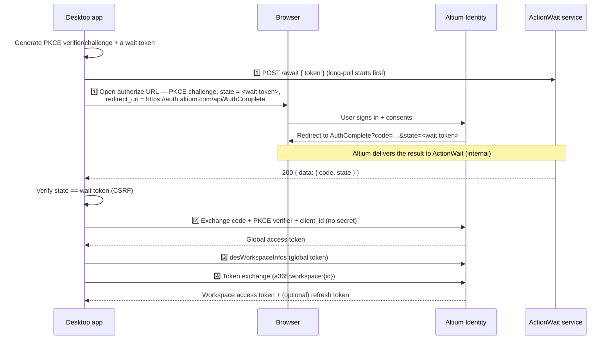

# Authenticate a desktop application

Desktop applications usually cannot host a public HTTPS redirect endpoint, yet OAuth requires the authorization response to arrive at a registered callback. The **ActionWait** pattern solves this: the user still signs in through the browser, the browser is redirected to an **Altium-hosted** callback page, and your application picks up the result over an HTTP long-polling channel instead of hosting a redirect itself.

Desktop applications are typically **[public clients](https://oauth.net/2/client-types/)** — they cannot keep a client secret, so they authenticate with **[PKCE](https://oauth.net/2/pkce/)** and never send a `client_secret`. Every token request in this guide carries `client_id` (and, for the code exchange, the PKCE `code_verifier`) and **no** `Authorization: Basic` header.

See [Key terms](./overview.md#key-terms) for token vocabulary and [Register your application](./register-your-application.md) for details on registering a new application.

## Flow at a glance



After the ActionWait step delivers the authorization code, the flow follows the same logical steps as a web application — exchange the code, discover workspaces, exchange for a workspace token, refresh — **but as a public client**. Those steps are reproduced in full below so this guide stands on its own.

## Step 1 — Start the ActionWait long-poll, then open the browser

Generate a PKCE `code_verifier` (a high-entropy random string), derive the `code_challenge` as the base64url-encoded SHA-256 of the verifier, and generate a single high-entropy **wait token** (a UUID works well).

**The linchpin: one value is both `state` and the wait token.** Your app uses that wait token in two places at once:

- as the OAuth **`state`** parameter in the authorize request, and
- as the ActionWait **wait token** it long-polls with.

That shared value is what correlates the browser redirect back to your waiting app: the Altium-hosted callback receives the `code` and `state` from the browser and hands them to the ActionWait service, which routes them to the poll whose token equals that `state`. Because only your app and Altium Identity know this value, verifying that the returned `state` matches the token you generated also serves as **CSRF protection**.

**Start the long-poll first.** POST your wait token to the ActionWait service *before* opening the browser, so a fast sign-in cannot deliver the result before you are listening for it:

```
POST https://actionwait.altium.com/await
Content-Type: application/json

{ "token": "<wait_token>" }
```

cURL:

```bash
curl -X POST https://actionwait.altium.com/await \
  -H "Content-Type: application/json" \
  -d '{"token":"<wait_token>"}'
```

The server holds this request open until the result arrives or the poll's hold interval elapses; if the interval elapses first it returns `408` — this is normal, and you immediately reconnect with the **same** token. Treat the hold interval as an implementation detail: don't assume a fixed duration, just reconnect on `408`. See [ActionWait service API](#actionwait-service-api) below for the full protocol.

**Then open the browser** at the authorize URL, using the same wait token as `state` and the Altium-hosted `AuthComplete` callback as `redirect_uri`:

```
GET https://auth.altium.com/connect/authorize
  ?client_id=<client_id>
  &response_type=code
  &scope=openid+profile
  &redirect_uri=https%3A%2F%2Fauth.altium.com%2Fapi%2FAuthComplete
  &code_challenge=<code_challenge>
  &code_challenge_method=S256
  &state=<wait_token>
```

- `redirect_uri` **must** be the fixed Altium-hosted callback `https://auth.altium.com/api/AuthComplete` — you do not register your own.
- `state` **must** be the identical value you long-poll with as the wait token.

When the poll returns `200 { data: { code, state } }`, verify `data.state` equals your wait token, then continue to Step 2 with `data.code`.

### Getting a workspace-scoped token directly

If you already know the workspace the user should land on, request it up front: include `a365:workspace:<workspaceId>` in the `scope` parameter above, and the code exchange in Step 2 returns the workspace token (and refresh token, with `offline_access`) directly, skipping Steps 3–4 below.

If you don't know the workspace ahead of time but still want the user to land on one during sign-in, add the optional `selectWorkspace` parameter to the authorize request instead, to have the code exchange return a workspace-scoped token directly. See [Login-into-workspace mode](./overview.md#login-into-workspace-mode) for the values (`none` / `strict` / `optional`) and behavior.

```
GET https://auth.altium.com/connect/authorize
  ?client_id=<client_id>
  &response_type=code
  &scope=openid+profile+offline_access
  &redirect_uri=https%3A%2F%2Fauth.altium.com%2Fapi%2FAuthComplete
  &code_challenge=<code_challenge>
  &code_challenge_method=S256
  &state=<wait_token>
  &selectWorkspace=optional
```

## Step 2 — Exchange the code for a global access token

As a **public client** you authenticate with `client_id` and the PKCE `code_verifier` — there is **no** `client_secret` and **no** `Authorization: Basic` header.

```
POST https://auth.altium.com/connect/token
Content-Type: application/x-www-form-urlencoded

grant_type=authorization_code
&code=<code>
&code_verifier=<code_verifier>
&redirect_uri=https%3A%2F%2Fauth.altium.com%2Fapi%2FAuthComplete
&client_id=<client_id>
```

cURL:

```bash
curl -X POST https://auth.altium.com/connect/token \
  -H "Content-Type: application/x-www-form-urlencoded" \
  -d "grant_type=authorization_code" \
  -d "code=<code>" \
  -d "code_verifier=<code_verifier>" \
  -d "client_id=<client_id>" \
  --data-urlencode "redirect_uri=https://auth.altium.com/api/AuthComplete"
```

`redirect_uri` must be the same Altium-hosted callback you used in the authorize request (`https://auth.altium.com/api/AuthComplete`), and must match exactly.

Response:

```json
{
  "id_token": "...",
  "access_token": "...",
  "expires_in": 14400,
  "token_type": "Bearer",
  "scope": "openid profile"
}
```

The `access_token` is your **global access token**.

## Step 3 — Discover the user's workspaces

Query the Altium 365 API with the global access token to list workspaces, then let the user choose one. Include `location.name` — it tells you whether a workspace lives in GovCloud, which decides *where* you exchange the token in Step 4.

```graphql
query {
  desWorkspaceInfos {
    authId
    name
    url
    location {
      name
    }
  }
}
```

A GovCloud workspace reports `location.name = "US GovCloud"`:

```json
{
  "authId": "110ee681-0f50-48e4-a1d1-0e7466ab8682",
  "name": "Example GovCloud workspace",
  "url": "https://example-workspace.365-gov.altium.com/",
  "location": {
    "name": "US GovCloud"
  }
}
```

Use the chosen workspace's `authId` as `{workspaceId}` in the next step, and its `location.name` to pick the exchange endpoint. Checking for a GovCloud `location.name` is the current recommended way to tell Gov workspaces apart.

See the [API examples](https://www.altium.com/documentation/altium-developer-center/altium-365/api/examples).

## Step 4 — Exchange for a workspace access token

Exchange the global access token for a token scoped to the chosen workspace, **at the endpoint that matches the workspace's `location`** (Step 3). Requesting `offline_access` also returns a refresh token. In both variants `subject_token` is the same global access token from Step 2, and you send `client_id` with **no** `client_secret`.

**Commercial workspace — exchange on `auth.altium.com`:**

```
POST https://auth.altium.com/connect/token
Content-Type: application/x-www-form-urlencoded

grant_type=urn:ietf:params:oauth:grant-type:token-exchange
&scope=openid offline_access a365:workspace:<workspaceId>
&subject_token_type=urn:ietf:params:oauth:token-type:access_token
&subject_token=<global access token>
&client_id=<client_id>
```

**GovCloud workspace (`location.name = "US GovCloud"`) — exchange on `auth.365-gov.altium.com` and add `secure=1`:**

```
POST https://auth.365-gov.altium.com/connect/token
Content-Type: application/x-www-form-urlencoded

grant_type=urn:ietf:params:oauth:grant-type:token-exchange
&scope=openid offline_access a365:workspace:<workspaceId>
&subject_token_type=urn:ietf:params:oauth:token-type:access_token
&subject_token=<global access token>
&secure=1
&client_id=<client_id>
```

Everything up to this point — the browser sign-in, the `AuthComplete` redirect, the ActionWait poll host, and the code exchange — runs on Commercial `auth.altium.com` and yields a global access token. Presenting that Commercial global token to the Gov `/token` endpoint with `secure=1` mints a Gov workspace token — one whose `iss` is `https://auth.365-gov.altium.com` and which carries a `secure` claim. Omitting `secure=1` on the Gov endpoint — or exchanging a Gov workspace on `auth.altium.com` — returns `access_denied`. See [GovCloud considerations](./govcloud.md).

cURL (Commercial workspace; for a Gov workspace, target `https://auth.365-gov.altium.com` and add `--data-urlencode "secure=1"`):

```bash
curl -X POST https://auth.altium.com/connect/token \
  -H "Content-Type: application/x-www-form-urlencoded" \
  --data-urlencode "grant_type=urn:ietf:params:oauth:grant-type:token-exchange" \
  --data-urlencode "scope=openid offline_access a365:workspace:<workspaceId>" \
  --data-urlencode "subject_token_type=urn:ietf:params:oauth:token-type:access_token" \
  --data-urlencode "subject_token=<global access token>" \
  --data-urlencode "client_id=<client_id>"
```

Response (both variants):

```json
{
  "access_token": "...",
  "expires_in": 14400,
  "token_type": "Bearer",
  "refresh_token": "...",
  "scope": "a365:workspace:<workspaceId> offline_access openid"
}
```

The `access_token` is your **workspace access token**. Use it to call the Altium 365 API for that workspace:

```
Authorization: Bearer <workspace access token>
```

If you already know the workspace at sign-in time, see [Getting a workspace-scoped token directly](#getting-a-workspace-scoped-token-directly) in Step 1 to skip Steps 3–4 above.

## Refresh the workspace access token

When the workspace access token expires, use the refresh token to get a new one. **Refresh at the endpoint that issued the token:** a Commercial workspace token refreshes on `auth.altium.com`; a GovCloud workspace token refreshes on `auth.365-gov.altium.com` **with `secure=1`**. As a public client you send `client_id` with no secret.

```
POST https://auth.altium.com/connect/token
Content-Type: application/x-www-form-urlencoded

grant_type=refresh_token
&refresh_token=<refresh_token>
&client_id=<client_id>
```

Response:

```json
{
  "id_token": "...",
  "access_token": "...",
  "expires_in": 14400,
  "token_type": "Bearer",
  "refresh_token": "...",
  "scope": "a365:workspace:<workspaceId> offline_access openid"
}
```

## Revoke a refresh token

**Only refresh tokens can be revoked.** Access tokens are self-contained (JWT) and are validated by signature rather than looked up per request, so they **cannot be revoked** — an issued access token stays valid until it expires. To cut a user off, revoke their **refresh token** (which stops it minting new access tokens) and discard the current access token; keep access-token lifetimes short.

POST the refresh token to the revocation endpoint. As a public client you authenticate with `client_id` in the body — no `Authorization: Basic` header.

```
POST https://auth.altium.com/connect/revocation
Content-Type: application/x-www-form-urlencoded

token=<refresh_token>
&token_type_hint=refresh_token
&client_id=<client_id>
```

cURL:

```bash
curl -X POST https://auth.altium.com/connect/revocation \
  -H "Content-Type: application/x-www-form-urlencoded" \
  -d "token=<refresh_token>" \
  -d "token_type_hint=refresh_token" \
  -d "client_id=<client_id>"
```

- `token` — the refresh token to revoke.
- `token_type_hint` — `refresh_token`.

A successful request returns `200 OK` with an empty body. Per the revocation standard, the endpoint also returns `200` for an unknown or already-invalid token, so a success response does not confirm the token previously existed.

## ActionWait service API

The ActionWait service is a **separate host** from Altium Identity: `https://actionwait.altium.com`. It has no Gov-specific host — Gov sign-in polls the same Commercial host. **AES (on-prem)** installations host their own ActionWait service at `{origin}/actionwait` instead — see [AES (on-prem) considerations](./aes.md).

**`POST /await`** — long-polls for the authorization result tied to your wait token.

Request (`Content-Type: application/json`):
```json
{ "token": "<wait_token>" }
```
Response on success (`200`):
```json
{ "data": { "code": "<authorization_code>", "state": "<wait_token>" } }
```
- `data.code` — the OAuth authorization code; exchange it at the token endpoint (Step 2).
- `data.state` — echoes your wait token; **verify it matches** before exchanging the code.

Status codes:

- `200` — the result is ready (body as above).
- `408` — the poll's hold interval elapsed with no result yet. **This is normal, not a failure** — immediately reconnect by POSTing `/await` again with the **same** token. Repeat until you get `200`, hit `410`, or your own overall timeout elapses.
- `410` — the wait token is no longer valid: it was already consumed, or a newer `/await` for the same token superseded this connection. Treat the attempt as over — start a fresh sign-in from Step 1 with a **new** wait token.

**Two distinct timeouts.** The server bounds how long it holds each `/await` request open before returning `408`; treat that hold interval as an implementation detail that may change, and simply reconnect whenever you receive a `408`. It is *not* how long a user has to sign in. Your app owns a separate **overall sign-in timeout** that spans the whole reconnect loop (for example, the TypeScript library defaults to 3 minutes and the .NET sign-in tool uses 5). When your overall timeout elapses, stop reconnecting and abandon the wait token.

## Troubleshooting

| Symptom | Likely cause | Fix |
| --- | --- | --- |
| `/await` returns `408` repeatedly | Normal long-poll cycling while the user is still signing in | Keep reconnecting with the same token; only give up after your own overall timeout |
| `/await` returns `410` | Token already consumed, or a second poll superseded this one | Start a new sign-in from Step 1 with a fresh token |
| Browser completes but app never returns | The `state` in the authorize request didn't match the `token` you poll with | Use the identical value for `state` and the wait `token` |
| `State mismatch` after `200` | Returned `data.state` ≠ your wait token (possible CSRF) | Abort the sign-in; do not exchange the code |
| `invalid_grant` at token endpoint | Code expired/already used, or `redirect_uri` ≠ `https://auth.altium.com/api/AuthComplete` | Restart sign-in; send the exact redirect URI and PKCE verifier |

## Related

- [Authentication overview](./overview.md) · [Web and server application flow](./web-and-server-apps.md)
- [GovCloud considerations](./govcloud.md) · [AES (on-prem) considerations](./aes.md)
