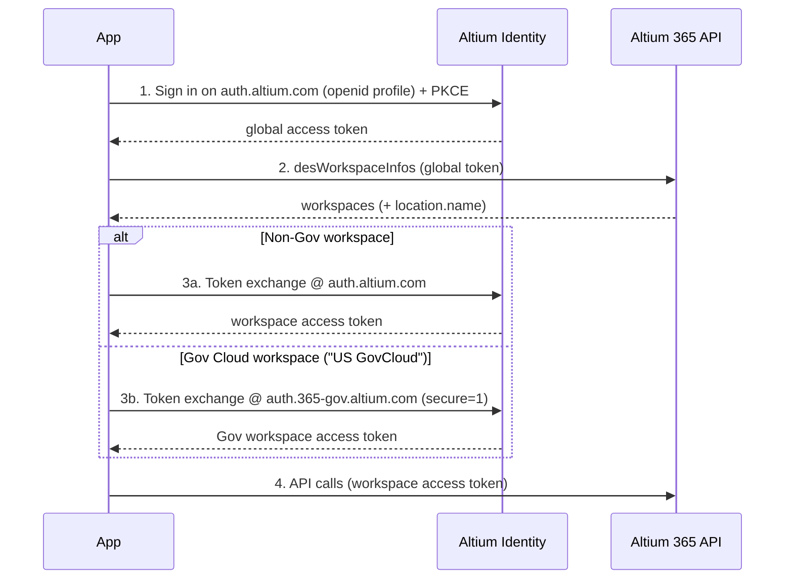

# Authentication

Altium Identity is Altium's OAuth 2.0 and OpenID Connect (OIDC) identity provider. Your application authenticates users through Altium Identity, then calls the Altium 365 API on their behalf.

- [OAuth 2.0](https://datatracker.ietf.org/doc/html/rfc6749)
- [OpenID Connect](https://openid.net/specs/openid-connect-core-1_0.html)

## Endpoints

Altium Identity is available at one base URL per environment:

| Name | Base URL | Discovery document |
| --- | --- | --- |
| Commercial Cloud | `https://auth.altium.com` | `https://auth.altium.com/.well-known/openid-configuration` |
| Gov Cloud | `https://auth.365-gov.altium.com` | `https://auth.365-gov.altium.com/.well-known/openid-configuration` |

See [Gov Cloud considerations](./gov-cloud.md) for the differences that apply to Gov Cloud.

Every endpoint below is published in each base URL's discovery document:

| Discovery key | Path | Purpose |
| --- | --- | --- |
| `authorization_endpoint` | `/connect/authorize` | Starts sign-in; returns an authorization code after the user authenticates and consents. |
| `token_endpoint` | `/connect/token` | Issues tokens — exchanges an authorization code, another access token (token-exchange), or a refresh token. |
| `userinfo_endpoint` | `/connect/userinfo` | Returns up-to-date identity claims for the signed-in user (call it with the access token). |
| `revocation_endpoint` | `/connect/revocation` | Revokes a refresh token. |

Prepend the base URL for your environment — for example, `https://auth.altium.com/connect/token`.

## Key terms

- **Global access token** — a user-level token you receive after sign-in with the `openid profile` scopes. Use it to discover which workspaces the user can access.
- **Workspace access token** — a token scoped to a single workspace through the `a365:workspace:{workspaceId}` scope. Use it for Altium 365 API calls against that workspace.
- **Refresh token** — issued when you request the `offline_access` scope; use it to obtain a new access token (global or workspace) without asking the user to sign in again.
- **Workspace context** — the workspace identity carried by the `a365:workspace:{workspaceId}` scope.

## About the workspace scope

The `a365:workspace:{workspaceId}` scope plays two roles today: it transfers **workspace context** (which workspace the token is for) and grants **access to that workspace's resources**. It is the same scope across Altium 365 and Altium Enterprise Server. Additional scopes may appear in the discovery document over time; this guide uses `a365:workspace:{workspaceId}`.

See the [OAuth Scopes](https://www.altium.com/documentation/altium-developer-center/altium-365/key-concepts/oauth-scopes) key concept.

## The authentication journey

The recommended flow is the same for web and desktop/on-prem apps — only *how* you obtain the authorization code differs (a redirect you host, or the [ActionWait](./desktop-and-onprem-apps.md) pattern). In both cases:

1. **Sign in on `https://auth.altium.com`** to get a **global access token**. Use it for accessing global resurses such as listing the user's workspaces.
2. **Discover the user's workspaces** with the global token. See [Discover the user's workspaces](./web-and-server-apps.md#step-3--discover-the-users-workspaces).
3. **Exchange the global token for a workspace access token — at the endpoint that matches the workspace:**
   - **Non-Gov workspace** → exchange on Commercial Cloud endpoint (`https://auth.altium.com`, no `secure=1`).
   - **Gov Cloud workspace** → exchange on Gov Cloud endpoint (`https://auth.365-gov.altium.com`, with `secure=1`). See [Gov Cloud considerations](./gov-cloud.md).
4. **Call the Altium 365 API** with the workspace token, refreshing it at the endpoint that issued it.

An app commonly holds several tokens at once — one global token plus a workspace token per workspace in use (some non-Gov, some Gov). Each refreshes at its own issuing endpoint.

### Where to send each request

| Operation | Endpoint | `secure=1` |
| --- | --- | --- |
| Sign in + code exchange | `auth.altium.com` | — |
| User profile / discover workspaces | `auth.altium.com` / Altium 365 API | — |
| Non-Gov workspace token (exchange + refresh) | `auth.altium.com` | no |
| Gov Cloud workspace token (exchange + refresh) | `auth.365-gov.altium.com` | yes |

## Which flow do I need?

- **Web or server application** that can host an HTTPS redirect endpoint: [Authenticate a web or server application](./web-and-server-apps.md).
- **Desktop or on-prem application** that cannot host a public redirect: [Authenticate a desktop or on-prem application](./desktop-and-onprem-apps.md).

Both guides cover Gov Cloud workspaces via the exchange branch above. See [Gov Cloud considerations](./gov-cloud.md) for additional details.

## Related

- [Register your application](./register-your-application.md)
- [Access token claims](./token-claims.md) — what's inside a token (`iss`, `workspaceId`, `secure`, scopes)
- [Tokens](https://www.altium.com/documentation/altium-developer-center/altium-365/key-concepts/tokens)
- [OAuth Scopes](https://www.altium.com/documentation/altium-developer-center/altium-365/key-concepts/oauth-scopes)
- [Realms](https://www.altium.com/documentation/altium-developer-center/altium-365/key-concepts/realms) · [GRID](https://www.altium.com/documentation/altium-developer-center/altium-365/key-concepts/grid)
