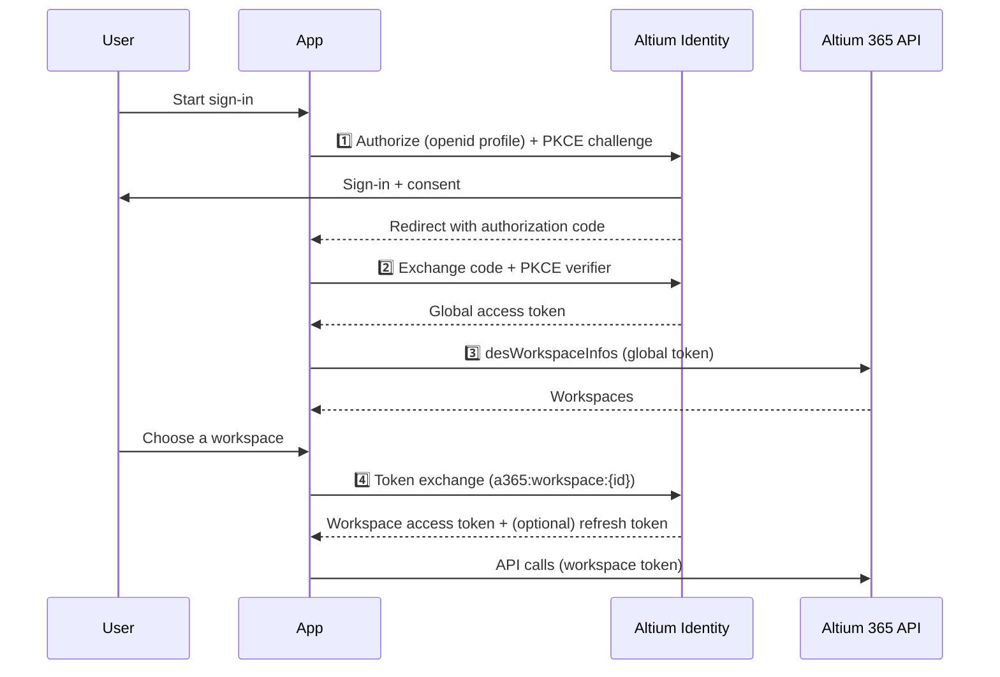

# Authenticate a web or server application

This guide walks through the standard authentication flow for applications that can host an HTTPS redirect endpoint. See [Key terms](./overview.md#key-terms) for the token vocabulary used here.

**Prerequisites:** a registered application with a `client_id`, `client_secret`, and redirect URL. See [Register your application](./register-your-application.md).

## Flow at a glance



## Step 1 — Request authorization (with PKCE)

Generate a PKCE `code_verifier` (a high-entropy random string) and derive the `code_challenge` as the base64url-encoded SHA-256 of the verifier. Redirect the user to:

```
GET https://auth.altium.com/connect/authorize
  ?client_id=<client_id>
  &response_type=code
  &scope=openid+profile
  &redirect_uri=https%3A%2F%2Fyour-app.example.com%2Foauth%2Fcallback
  &code_challenge=<code_challenge>
  &code_challenge_method=S256
  &state=<opaque_state>
```

- `redirect_uri` is the callback URL you registered with your application.
- `state` is an opaque value you generate and later verify to protect against CSRF.

After sign-in and consent, Altium Identity redirects to your callback:

```
GET https://your-app.example.com/oauth/callback?code=<code>&state=<opaque_state>
```

If the user declines consent, the callback carries an error instead:

```
GET https://your-app.example.com/oauth/callback?error=consent_required&state=<opaque_state>&session_state=<session_state>
```

## Step 2 — Exchange the code for a global access token

This guide authenticates as a **confidential client** using `Authorization: Basic <base64(client_id:client_secret)>`. **Public clients** (desktop/native/SPA) have no secret — they omit the Basic header and authenticate with `client_id` plus the PKCE `code_verifier` instead. See [Authenticate a desktop or on-prem application](./desktop-and-onprem-apps.md).

```
POST https://auth.altium.com/connect/token
Authorization: Basic <base64(client_id:client_secret)>
Content-Type: application/x-www-form-urlencoded

grant_type=authorization_code
&code=<code>
&code_verifier=<code_verifier>
&redirect_uri=https%3A%2F%2Fyour-app.example.com%2Foauth%2Fcallback
```

cURL:

```bash
curl -X POST https://auth.altium.com/connect/token \
  -u "<client_id>:<client_secret>" \
  -H "Content-Type: application/x-www-form-urlencoded" \
  -d "grant_type=authorization_code" \
  -d "code=<code>" \
  -d "code_verifier=<code_verifier>" \
  --data-urlencode "redirect_uri=https://your-app.example.com/oauth/callback"
```

Response:

```json
{
  "id_token": "...",
  "access_token": "...",
  "expires_in": 14400,
  "token_type": "Bearer",
  "scope": "openid profile"
}
```

The `access_token` is your **global access token**.

### Read the user's profile (optional)

The `id_token` already carries identity claims. For up-to-date claims, call the userinfo endpoint with the access token:

```
GET https://auth.altium.com/connect/userinfo
Authorization: Bearer <access token>
```

cURL:

```bash
curl https://auth.altium.com/connect/userinfo \
  -H "Authorization: Bearer <access token>"
```

Response (a JSON object of claims; the exact set depends on the granted scopes and the user's profile):

```json
{
  "sub": "00000000-0000-0000-0000-000000000000",
  "username": "jane.engineer@example.com",
  "email": "jane.engineer@example.com",
  "given_name": "Jane",
  "family_name": "Engineer",
  "organization_id": "11111111-1111-1111-1111-111111111111",
  "picture": "https://ids.api.altium.com/UserPic/?picName=cus_<sub>&size=px128x128"
}
```

`sub` is the stable user identifier — the same value that appears in the `id_token`.

## Step 3 — Discover the user's workspaces

Query the Altium 365 API with the global access token to list workspaces, then let the user choose one. Include `location.name` — it tells you whether a workspace lives in Gov Cloud, which decides *where* you exchange the token in Step 4.

```graphql
query {
  desWorkspaceInfos {
    authId
    name
    url
    location {
      name
    }
  }
}
```

A Gov Cloud workspace reports `location.name = "US GovCloud"`:

```json
{
  "authId": "110ee681-0f50-48e4-a1d1-0e7466ab8682",
  "name": "OnShape GOV",
  "url": "https://altium-inc-8685.365-gov.altium.com/",
  "location": { 
    "name": "US GovCloud" 
  }
}
```

Use the chosen workspace's `authId` as `{workspaceId}` in the next step, and its `location.name` to pick the exchange endpoint. Checking for a GovCloud `location.name` is the current recommended way to tell Gov workspaces apart.

See the [API examples](https://www.altium.com/documentation/altium-developer-center/altium-365/api/examples).

## Step 4 — Exchange for a workspace access token

Exchange the global access token for a token scoped to the chosen workspace, **at the endpoint that matches the workspace's `location`** (Step 3). Requesting `offline_access` also returns a refresh token. In both variants `subject_token` is the same global access token from Step 2.

**Non-Gov workspace — exchange on `auth.altium.com`:**

```
POST https://auth.altium.com/connect/token
Content-Type: application/x-www-form-urlencoded

grant_type=urn:ietf:params:oauth:grant-type:token-exchange
&scope=openid offline_access a365:workspace:<workspaceId>
&subject_token_type=urn:ietf:params:oauth:token-type:access_token
&subject_token=<global access token>
&client_id=<client_id>
&client_secret=<client_secret>
```

**Gov Cloud workspace (`location.name = "US GovCloud"`) — exchange on `auth.365-gov.altium.com` and add `secure=1`:**

```
POST https://auth.365-gov.altium.com/connect/token
Content-Type: application/x-www-form-urlencoded

grant_type=urn:ietf:params:oauth:grant-type:token-exchange
&scope=openid offline_access a365:workspace:<workspaceId>
&subject_token_type=urn:ietf:params:oauth:token-type:access_token
&subject_token=<global access token>
&secure=1
&client_id=<client_id>
&client_secret=<client_secret>
```

Presenting your Commercial global token to the Gov `/token` endpoint with `secure=1` mints a Gov workspace token — one whose `iss` is `https://auth.365-gov.altium.com` and which carries a `secure` claim. Omitting `secure=1` on the Gov endpoint — or exchanging a Gov workspace on `auth.altium.com` — returns `access_denied`. See [Gov Cloud considerations](./gov-cloud.md).

cURL (non-Gov; for a Gov workspace, target `https://auth.365-gov.altium.com` and add `--data-urlencode "secure=1"`):

```bash
curl -X POST https://auth.altium.com/connect/token \
  -H "Content-Type: application/x-www-form-urlencoded" \
  --data-urlencode "grant_type=urn:ietf:params:oauth:grant-type:token-exchange" \
  --data-urlencode "scope=openid offline_access a365:workspace:<workspaceId>" \
  --data-urlencode "subject_token_type=urn:ietf:params:oauth:token-type:access_token" \
  --data-urlencode "subject_token=<global access token>" \
  --data-urlencode "client_id=<client_id>" \
  --data-urlencode "client_secret=<client_secret>"
```

Response (both variants):

```json
{
  "access_token": "...",
  "expires_in": 14400,
  "token_type": "Bearer",
  "refresh_token": "...",
  "scope": "a365:workspace:<workspaceId> offline_access openid"
}
```

The `access_token` is your **workspace access token**. Use it to call the Altium 365 API for that workspace:

```
Authorization: Bearer <workspace access token>
```

> **Shortcut when you already know the workspace.** Request the workspace scope directly in Step 1 — set `scope=openid profile offline_access a365:workspace:<workspaceId>` in the authorize request — and the code exchange in Step 2 returns the workspace token (and refresh token) directly, skipping Steps 3–4. Run the *whole* flow on the host that matches the workspace: `auth.altium.com` for a non-Gov workspace, or `auth.365-gov.altium.com` with `secure=1` (on both the authorize and token requests) for a Gov Cloud workspace. Use the discover-then-exchange flow (Steps 3–4) when the user chooses a workspace at runtime.

## Refresh the workspace access token

When the workspace access token expires, use the refresh token to get a new one. **Refresh at the endpoint that issued the token:** a non-Gov workspace token refreshes on `auth.altium.com`; a Gov Cloud workspace token refreshes on `auth.365-gov.altium.com` **with `secure=1`**.

```
POST https://auth.altium.com/connect/token
Content-Type: application/x-www-form-urlencoded

grant_type=refresh_token
&refresh_token=<refresh_token>
&client_id=<client_id>
&client_secret=<client_secret>
```

Response:

```json
{
  "id_token": "...",
  "access_token": "...",
  "expires_in": 14400,
  "token_type": "Bearer",
  "refresh_token": "...",
  "scope": "a365:workspace:<workspaceId> offline_access openid"
}
```

## Revoke a refresh token

**Only refresh tokens can be revoked.** Access tokens are self-contained (JWT) and are validated by signature rather than looked up per request, so they **cannot be revoked** — an issued access token stays valid until it expires. To cut a user off, revoke their **refresh token** (which stops it minting new access tokens) and discard the current access token; keep access-token lifetimes short.

POST the refresh token to the revocation endpoint, authenticating with your client credentials:

```
POST https://auth.altium.com/connect/revocation
Authorization: Basic <base64(client_id:client_secret)>
Content-Type: application/x-www-form-urlencoded

token=<refresh_token>
&token_type_hint=refresh_token
```

cURL:

```bash
curl -X POST https://auth.altium.com/connect/revocation \
  -u "<client_id>:<client_secret>" \
  -H "Content-Type: application/x-www-form-urlencoded" \
  -d "token=<refresh_token>" \
  -d "token_type_hint=refresh_token"
```

- `token` — the refresh token to revoke.
- `token_type_hint` — `refresh_token`.

A successful request returns `200 OK` with an empty body. Per the revocation standard, the endpoint also returns `200` for an unknown or already-invalid token, so a success response does not confirm the token previously existed.

## Related

- [Authentication overview](./overview.md) · [Register your application](./register-your-application.md)
- [Gov Cloud considerations](./gov-cloud.md)
